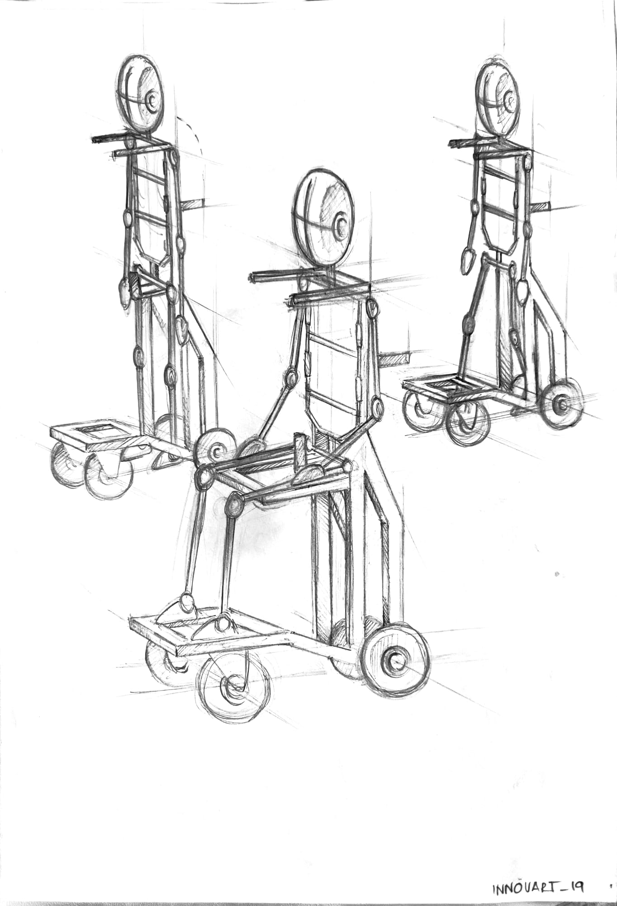
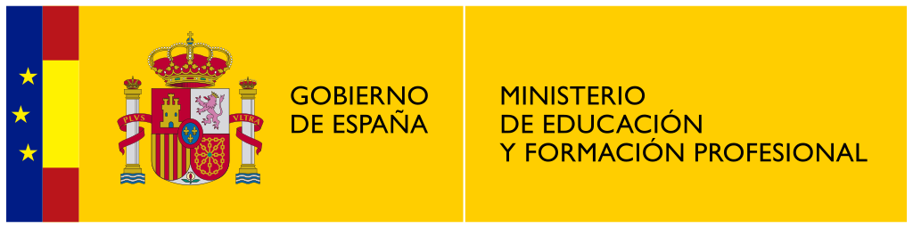
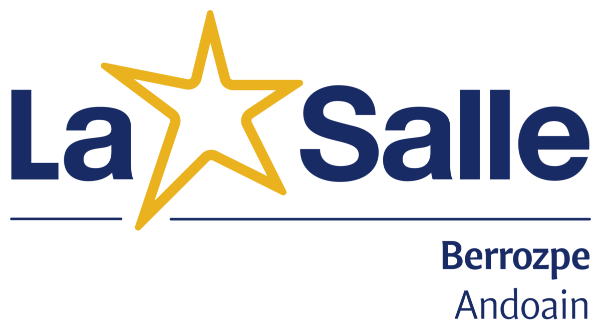
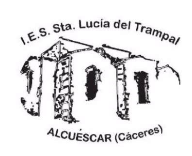

# Bipedestador: Un paso más en la inclusión ♿✨

Este repositorio contiene los archivos de diseño (STL e IGS) del proyecto **"Bipedestador, un paso más en la inclusión"**. Es una iniciativa de innovación aplicada orientada a mejorar la calidad de vida y la participación en el aula de personas con movilidad reducida.

  

---

## 🏛️ Institución y Financiación

Este proyecto ha sido desarrollado bajo el marco del **Ministerio de Educación y Formación Profesional (MEFP)** de España.

  
   
  
  

---

## 🛠️ Sobre el Proyecto

El objetivo principal es el diseño y construcción de una **silla bipedestadora motorizada** que sea técnica y económicamente accesible. El proyecto surge de una necesidad real: facilitar que alumnos con diversidad funcional puedan participar en las dinámicas escolares (como ponerse de pie) de forma autónoma y segura.

### Centros Participantes:
- **IES Santa Lucía del Trampal** (Alcuéscar, Cáceres) - Centro Coordinador.
- **La Salle Berrozpe** (Andoain, Gipuzkoa).
- Colaboración técnica: **APRECAMEX**.

---

## 📂 Contenido del Repositorio

En este repositorio encontrarás los archivos necesarios para la replicación y mejora del prototipo:

- **`/Modelos_3D/STL`**: Archivos listos para impresión 3D o visualización rápida.
- **`/Modelos_3D/IGS`**: Formato de intercambio para CAD (SolidWorks, AutoCAD, etc.), ideal para realizar modificaciones técnicas.
- **`/Documentacion`**: Guías y especificaciones técnicas derivadas de la memoria del proyecto.

---

## 🚀 Cómo usar estos archivos

1. **Descarga:** Puedes clonar el repositorio o descargar el archivo ZIP con los modelos.
2. **Edición:** Los archivos `.IGS` son compatibles con la mayoría de software de diseño industrial (SolidWorks, Inventor, Rhino).
3. **Impresión:** Los archivos `.STL` están optimizados para prototipado rápido.

---

## 📜 Licencia y Uso Libre

Este es un proyecto de **código abierto (Open Source)**. El objetivo es que estos archivos sean libres para cualquier persona, centro educativo o institución que necesite fabricar o mejorar este dispositivo para ayudar a colectivos con necesidades especiales.

Todo el material de este repositorio se distribuye bajo la licencia **Creative Commons Atribución 4.0 Internacional (CC BY 4.0)**.

  
   
  Esta obra está bajo una <a href="http://creativecommons.org/licenses/by/4.0/">Licencia Creative Commons Atribución 4.0 Internacional</a>.

---

## 🤝 Agradecimientos

Agradecemos especialmente a **Josune y Udane** por ser la inspiración y el motor de este proyecto, ayudándonos a visibilizar las necesidades reales y a trabajar por una sociedad más inclusiva.

---

  
  

